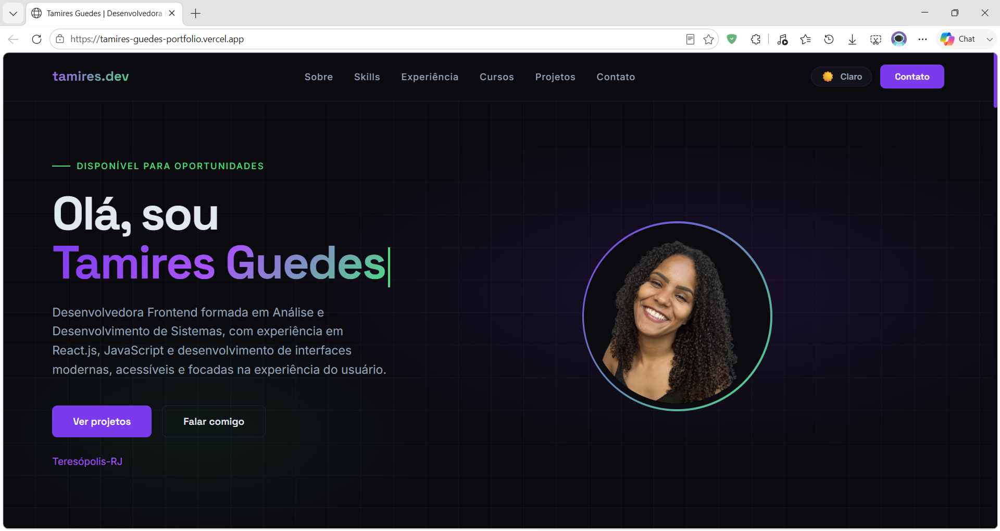

# 💜 Portfólio - Tamires Guedes

Portfólio profissional desenvolvido para apresentar minha trajetória, experiências, habilidades técnicas, certificações e projetos na área de desenvolvimento web.

## 🚀 Acesse Online

🌐 https://tamires-guedes-portfolio.vercel.app/

## 📸 Preview



## ✨ Funcionalidades

- Tema claro e escuro
- Layout responsivo
- Apresentação profissional
- Seção Sobre Mim
- Habilidades técnicas
- Experiência profissional
- Cursos e certificações
- Projetos desenvolvidos
- Contato direto via e-mail, WhatsApp, LinkedIn e GitHub

## 🛠️ Tecnologias Utilizadas

- React.js
- JavaScript
- Vite
- HTML5
- CSS3

## 📂 Estrutura do Projeto

```text
src/
├── assets/
├── components/
├── data/
├── hooks/
├── styles/
├── App.jsx
└── main.jsx
````

## 📌 Principais Projetos

* Sistema de Gestão de Clientes e Tickets
* Terê Verde Online
* Clone da Página Inicial do Instagram
* To-Do List Interativa
* Portal Runner – Aventura Multidimensional

## 👩‍💻 Sobre Mim

Graduada em Análise e Desenvolvimento de Sistemas pela UNIFESO, com foco em Desenvolvimento Front-End e interesse em criar interfaces modernas, acessíveis e funcionais.

## 🔗 Contato

* LinkedIn: [https://linkedin.com/in/t-guedes](https://linkedin.com/in/t-guedes)
* GitHub: [https://github.com/t-guedes](https://github.com/t-guedes)
* E-mail: [tamiresguedesb@gmail.com](mailto:tamiresguedesb@gmail.com)

---

Desenvolvido com React.js e muito ☕ por Tamires Guedes.
